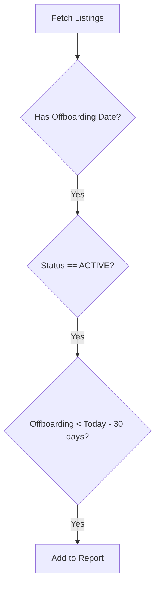
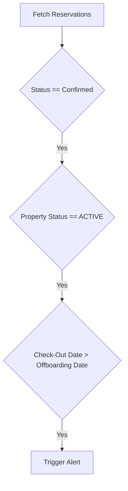
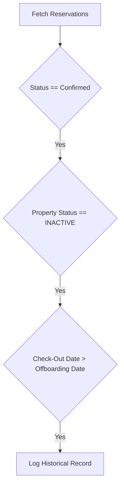
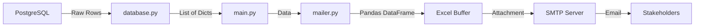

# Property Offboarding Alerts V2

This repository contains an automated auditing system designed to monitor property offboarding processes. The project connects to a PostgreSQL database to analyze property statuses and reservations, generating a detailed email report with an Excel attachment if any anomalies are detected regarding offboarding dates and active reservations.

## Table of Contents

- Project Overview
- Features
- Installation
- Environment Setup
- Project Structure
- Report Logic Documentation
  - Proactive Inventory
  - Active Alerts
  - Reactive History
- Data Flow
- Execution Steps
- Configuration Options
- Performance Considerations
- Error Handling
- Integration Points
- Troubleshooting
- Improvement Opportunities
- Contributing
- License

## Project Overview

Property Offboarding Alerts V2 is a backend utility designed to ensure operational compliance when offboarding properties. It serves as a safety net to detect:
1. Properties that should have been deactivated but remain active.
2. Reservations that conflict with the offboarding date (Check-out date > Offboarding date).

The system is built using Python and leverages `pandas` for data manipulation and `psycopg2` for database interactions. It runs as a standalone job that can be scheduled via cron or Task Scheduler.

## Features

- **Data Ingestion**: Secure connection to PostgreSQL with retry logic to fetch listing and reservation data.
- **Data Processing**: Clean and transform raw database rows into structured Pandas DataFrames.
- **Proactive Monitoring**: Identifies active properties past their offboarding date (> 30 days).
- **Critical Alerting**: Detects confirmed reservations in active properties that violate offboarding dates.
- **Historical Analysis**: Logs violations in properties that have already been deactivated.
- **Automated Reporting**: Generates a formatted Excel file in-memory and sends it via SMTP (Gmail).
- **Robust Logging**: Dual logging to console and file (`execution.log`) for audit trails.

## Installation

To set up and run this project locally, follow these steps:

1. Clone the repository:

    ```bash
    git clone <repository_url>
    cd property_offboarding_alerts_V2
    ```

2. Set up a virtual environment (optional but recommended):

    ```bash
    python -m venv venv
    source venv/bin/activate  # On Windows: venv\Scripts\activate
    ```

3. Install the required dependencies:

    ```bash
    pip install -r requirements.txt
    ```

## Environment Setup

### Prerequisites

- Python 3.8 or higher.
- PostgreSQL database access.
- SMTP credentials (e.g., Gmail App Password).

### Environment Variables

Create a `.env` file in the root directory (`src/` or project root) with the following variables:

```ini
# Database Configuration
DB_HOST=your_db_host
DB_NAME=your_db_name
DB_USER=your_db_user
DB_PASS=your_db_password
DB_PORT=5432

# Email Configuration
EMAIL_SENDER=your_email@gmail.com
EMAIL_PASSWORD=your_app_password
EMAIL_CX=recipient1@example.com
EMAIL_RODRIGO=recipient2@example.com
```

## 🛠️ Usage

To run the audit manually, execute the main script:

```bash
python src/main.py
```

### Execution Flow
1. The script initializes and sets up logging (Console + `execution.log`).
2. It queries the database for the three types of reports.
3. If data is found, it processes the data into an Excel file in memory.
4. An email is sent to the configured recipients with the Excel file attached.
5. If no data is found, it logs "No data to report" and exits.

## Report Logic Documentation

The system generates three distinct types of reports within a single Excel file.

### Proactive Inventory

Identifies properties that are technically "Active" in the system but have an offboarding date set more than 30 days ago.

#### Logic Flow



### Active Alerts

Detects **urgent** violations where a reservation exists after the offboarding date in a property that is still active.

#### Logic Flow



### Reactive History

Logs historical violations for properties that are now "Inactive". This is useful for auditing past operational failures.

#### Logic Flow



## Data Flow

The overall data flow through the system is as follows:



## Configuration Options

Configuration is managed primarily through the `.env` file.

- **Database**: Connection parameters (`DB_HOST`, `DB_PORT`, etc.).
- **Email**: Sender credentials and recipient lists (`EMAIL_CX`, `EMAIL_RODRIGO`). Recipient lists are comma-separated.

## Performance Considerations

- **Database Connections**: The system uses a retry mechanism (3 attempts) with a backoff delay to handle transient network issues.
- **Memory Usage**: Excel files are generated in-memory using `io.BytesIO` buffers to avoid writing temporary files to disk, which improves performance in containerized environments.

## Error Handling

The system includes specific mechanisms to handle failures:

- **Database Retry Logic**: The `DatabaseManager` attempts to execute queries with retries on operational errors.
- **Exception Catching**: The main execution block is wrapped in a `try-except` block to catch fatal errors and log them with `logger.critical`.
- **Logging**: All errors and info messages are saved to `execution.log` for post-mortem analysis.

## Integration Points

- **PostgreSQL**: Source of truth for listings and reservations (`mv_listings`, `guesty_listing`, `reservation_gold`).
- **SMTP (Gmail)**: Used for delivering the reports. Requires an App Password if using 2FA.

## Troubleshooting

### Common Issues

**Issue**: Connection to database fails.
**Solution**: Verify IP whitelisting for the database host and check credentials in `.env`.

**Issue**: Email not sending.
**Solution**: Check `execution.log` for SMTP authentication errors. Ensure `EMAIL_SENDER` has "Less secure app access" enabled or use an App Password.

**Issue**: Empty Excel file.
**Solution**: The system is designed to only send an email if data exists. If you receive no email, it likely means no violations were found (System is clean).

## License

This project is licensed under the MIT License.